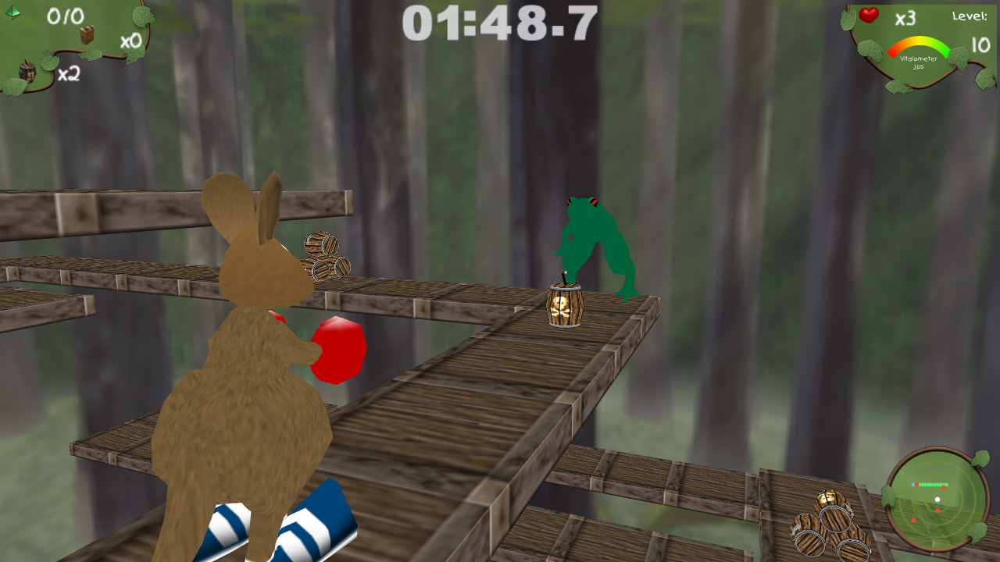
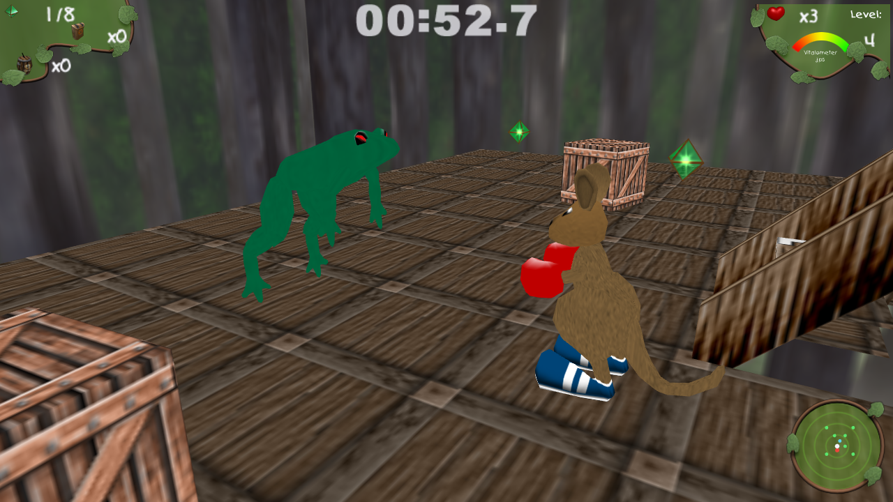
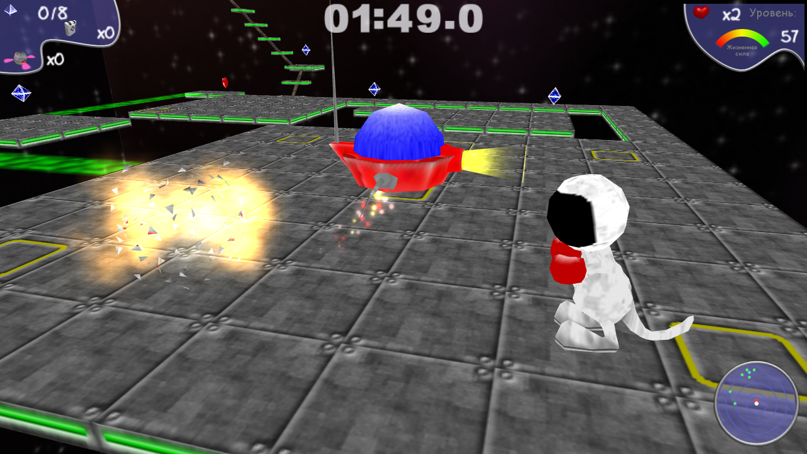
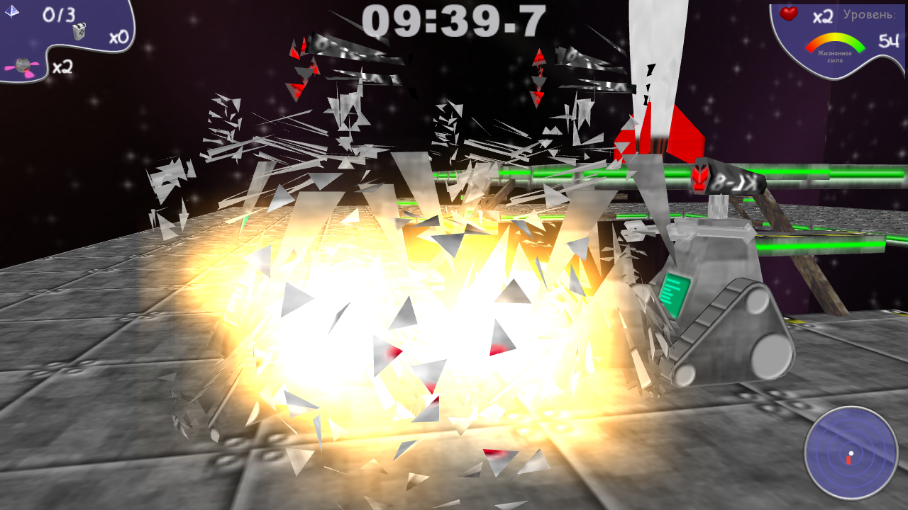
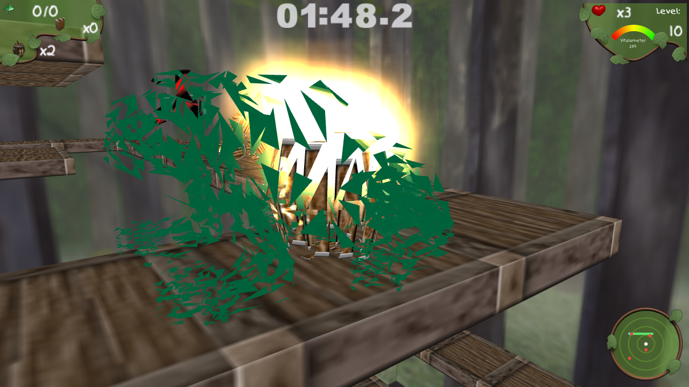

# Skippy / Ka'roo — native rewrite

A ground-up, native **C11 + [raylib](https://www.raylib.com/)** reimplementation of the 2001
Win32 game **Skippy Adventures / Ka'roo** (Fakt-Software), running on modern Linux — built by
**actively reverse-engineering** the original binary and its data formats.

> **Code only — bring your own game.** This repository contains *no* game assets. It reads the
> models, textures, levels, sounds and themes from an existing, legitimately-owned install of
> the original game, **in place and unmodified**. Nothing here is redistributable game data;
> nothing is altered on disk.



## What it is

The original is a 3D-rendered **2D tile-grid** puzzle-platformer: you hop a kangaroo (John)
across floating platforms, collect crystals to open the level exit, dodge enemies, and beat the
clock. This project rebuilds the engine from scratch — the game loop, the sim, the renderer —
against knowledge recovered from the shipped binary (Ghidra, disassembly, data-format decoding,
physics/timing constants and behavior rules pulled straight from the executable).

The load/parse path is ported to match the original **byte-for-byte**: the shipped
`.gam / .jjm / .mdl / .ani / .thm / .par / .tga / .wav / .leo / .jjs / .cdt` files are read
exactly as the game reads them — same formats, same field meanings, same slot enums. Saves and
highscores are written in the **original file formats** (`.sav` / `.hsc`), byte-compatible with
the real game's. The reverse-engineering notes that drive all of it live in
[`reference/`](reference/); [`reference/ARCHITECTURE.md`](reference/ARCHITECTURE.md) is the
engine overview.

## Status

Nearly the whole game is in place and playable:

- **Asset loaders** (`.gam .jjm .mdl .ani .thm .par .tga .leo .jjs .cdt`) — validated against
  the game's own `LevelReport.txt` debug oracle and byte-identical round-trip tests.
- **Rendering** — textured floating-platform tiles, stairs, skyboxes, per-theme worlds
  (Forest / Castle / Water / Egypt / Space / Candy / Final), and a fully **data-driven `.thm`
  Field-layer renderer**: each theme's ordered texture stacks with their own blend modes,
  Active/InActive state conditions, and Turn/Scroll/Pulse/Wobble/Flash animations — no
  per-theme special cases.
- **Movement & physics** — grid-step tank controls, RE-verified gravity / fall / stair rules,
  fall-and-splat death, ice runs, forced-direction slide chutes, paraglide gliding (with
  mid-air pickup collection, as some levels require).
- **Tiles & machinery** — elevators, moving platforms, teleporters, jump-pads, switches +
  extending bridges, glue pads, collapsing/regenerating destruct fields, blast-open obstacles.
- **Entities** — catcher enemies with BFS chase AI, thrower cannons, enemy factories
  (capped-alive, always-respawning), tile-blocking enemy collision.
- **Pickups** — crystals, hearts, time, freeze, speed, bombs, paraglide charges, protection,
  the inverse/slowdown debuffs, and the **surprise box** (random roll, straight from the RE).
- **Bombs** — throwable, gliding, riding movers, sliding on ice, fuse-burn audio, 3×3 blasts
  that clear obstacles and reward kills.
- **Menus & persistence** — title menu on the scripted `.jjs` camera background, pause menu,
  options (music/SFX volumes), save/load with the original's `.sav` slots, name entry,
  **highscores** in the original `.hsc` format, and the level-complete score summary using the
  original's exact scoring formula (crystals, extras, enemies, time, Sisyphus, vitality).
- **Audio** — theme-driven event SFX with a voice pool, positional 3D mixing, `.leo` ambience
  loops (fountains, bees), state-owned sustained loops (slides, movers) and retrigger sounds
  (bomb fuse, final-seconds clock) mirroring the original's DirectSound usage, and **CD music**
  streamed per-world via the `JJ.CDT` track map from your own ripped `audio/TrackNN.wav` files.
- **FX** — the decoded binary `.par` particle system: crystal glow, exit rings, blast debris,
  bee swarms, splash fountains, death-angel ascension.
- **HUD** — authentic per-theme panels, bitmap fonts, timer/counters, radar minimap, bonus
  status icons.
- **Debug tooling** — freecam, pause / frame-step, click-picker + warp, animation inspector,
  level switch, debug overlay.

### Known limitations

**A start-to-finish playthrough is not guaranteed.** The rewrite is faithful where it has been
exercised, but some levels can still be blocked by rough edges — enemy-AI quirks (pathing that
diverges from the original's, timing-sensitive setups), and assorted small behavioral gaps that
haven't been reverse-engineered yet. Treat it as a very playable work-in-progress, not a
finished port.

| | |
| --- | --- |
|  |  |
|  |  |

## Build

Requires a C11 compiler and **raylib** (developed against raylib 6.0 under `/usr/local`, found via
`pkg-config`).

```sh
make game        # build build/game
make             # build the format-loader test harnesses
make test        # run loader tests against your game data
```

The build is kept warning-free under `-Wall -Wextra -Wshadow`.

## Run

Point it at your own game install (defaults to `../game_root/EN`):

```sh
make run                                # level 1
make run BASE=/path/to/game LEVEL=4
./build/game /path/to/game 4            # start at a level index
```

The asset resolver handles Windows-style paths and case-insensitive lookups, so the install is
used as-is with no repackaging. For music, rip the disc's audio tracks to
`<BASE>/audio/Track02.wav` … — the game maps worlds to tracks through `CDTracks/JJ.CDT`.

### Controls

| Key | Action |
| --- | --- |
| **W / S** | hop forward / back |
| **A / D** | turn left / right |
| **SPACE** | throw a bomb (if you have ammo) |
| **ESC** | pause menu (options / save / load / quit) |
| **ENTER** | confirm (menus, score summary, skip intro) |
| **arrows** | menu navigation |

Debug keys: **F1** freecam (WASD + Q/E fly, RMB look, wheel dolly, **G** warp to the picked
tile), **F2** screenshot, **F3/F4** pause / frame-step, **F5** animation inspector (**F6/F7**
cycle clips), **F8/F9** previous / next level, **F10** debug overlay, **F11** fill crystals.
Left-click a tile to inspect it.

## Layout

```
src/
  formats/   asset loaders — engine-agnostic C (gam, jjm, mdl, ani, thm, par, tga, leo, jjs, sav, hsc, cdt)
  sim/       grid + entities + per-frame tick (movement, physics, tiles, AI) — engine-agnostic
  render/    renderer.h (thin backend interface) + renderer_raylib.c (rlgl immediate mode)
  game/      scene loading, rendering passes, camera, HUD, menus, audio, FX, mode machine
  main.c     game loop
tests/       loader validation against real files + LevelReport oracle
reference/   reverse-engineering docs + found_structs_ghidra.h (read-only reference)
```

The sim and loaders are engine-agnostic; the renderer sits behind a small interface
(`render/renderer.h`) so the backend stays swappable.

## Credits & provenance

The reverse-engineering (Ghidra, format decoding, physics/behavior extraction), debugging, and
overall direction are by **Oleksandr Mazur**. The codebase was then developed heavily in
collaboration with **Claude (Anthropic)** — pair-programming the port, the renderer, and the
iterative gameplay / FX / audio work against the reversed data.

All original game assets, code, and trademarks remain the property of their respective owners
(Fakt-Software). This is an independent, non-commercial fan reimplementation of the engine: it
ships **no** original data and is meant to be run with your own copy of the game.

## License

The code in this repository is released under the [0BSD license](LICENSE) — use it for
anything, no strings attached. (This covers the rewrite's code only, not the original game or
its assets.)
